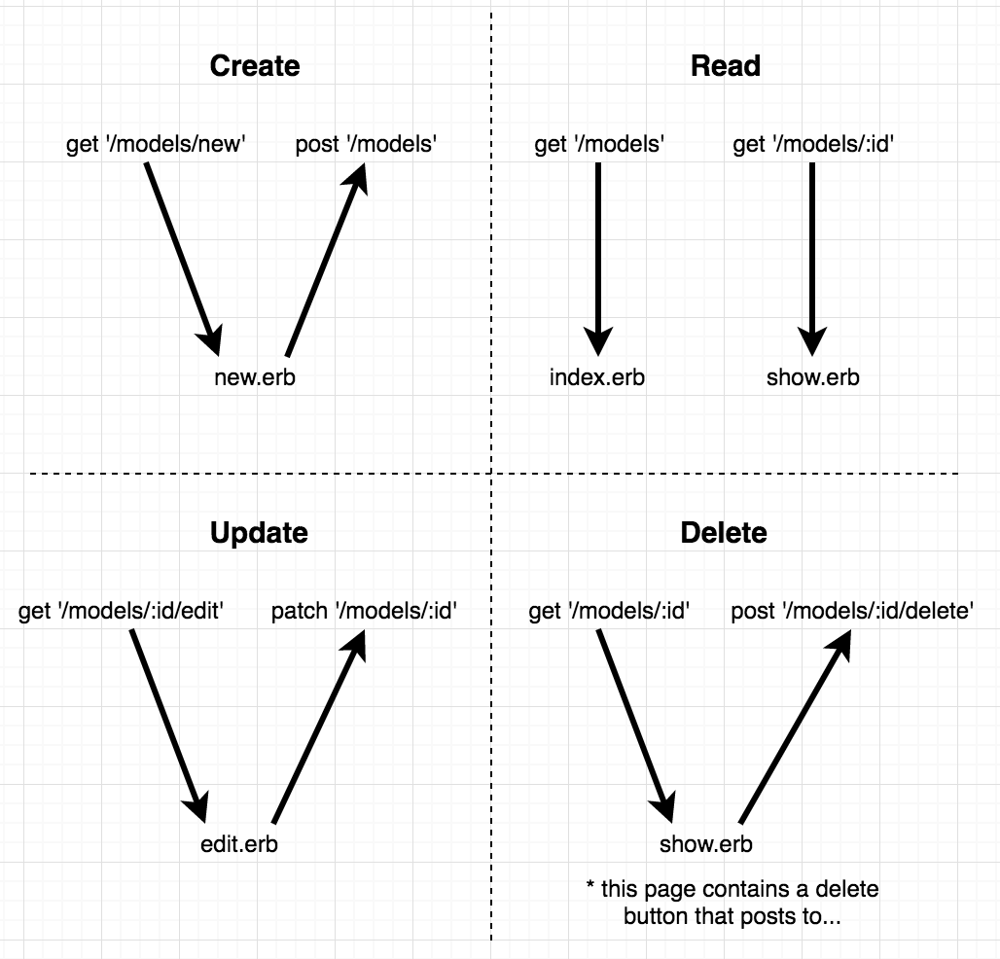
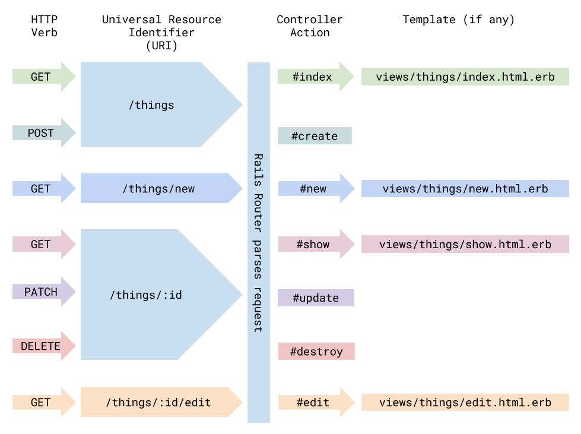

# Sinatra Forms and REST
## CRUD (Create, Read, Update, Delete)
* You can perform the CRUD actions using ActiveRecord

## REST (Representational State Transfer)
* RESTful routes provide a design pattern that allows for easy data manipulation (It’s nicer for users and nicer for developers to have everything consistent)
* Many of the CRUD actions are different actions that occur on the same resource

## Corneal
* A Ruby gem that is a Sinatra app generator with Rails-like simplicity (to implement basic directory structure of MVC App in Sinatra)

## Process of creating a sinatra app
1. corneal new game-ratings
2. Create database
   1. create_migration
   2. migrate
   3. (seed)
3. Create model
   1. `class Game < ActiveRecord::Base`
4. Create controller
   1. `class GamesController < ApplicationController`
   2. Add `use GamesController` to config.ru
   3. Create first route handler `get '/games' do` and render view
5. Create view (that corresponds to route handler)

## Implementation of RESTful Routing
* `Index`
* `Show`
* `New`
* `Edit`
* `Delete`

## Render vs. Redirect
### Render (`erb`)
* The `erb` syntax allows you to render partials, it knows to look in our views folder to render a certain view
* You can pass information via `instance variables` to your views from the controller
* `erb` does NOT create a new `get` request instead it's a reference to a file that will load in the browser

### Redirect (`redirect`)
- A redirect will make a separate http request to the server
- Does not allow for `instance variables` to be passed along

### When to use each one
General rule of thumb: If it’s a *successful* `post`, `patch`, `delete`, or an *unsuccessful* `get` do a redirect (otherwise render)

Things to keep in mind:
1. Don’t make a new HTTP request when not necessary
2. Remember that a “render” doesn't change the url of the page, make sure the urls make sense to the user when you use render.
3. When we submit a form successfully we want to redirect to prevent resubmission of that form
